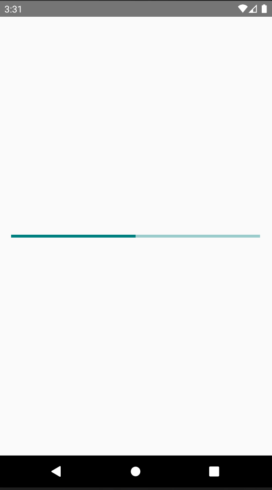

# react-native-paper-progressbar

This is a custom component for React Native, a simple progressbar from react native paper, compatible with ios and android.

## Installation

#### yarn

```
yarn add https://github.com/abdulhaseeb026/react-native-paper-progressbar
```

or

#### npm

```
npm i --save https://github.com/abdulhaseeb026/react-native-paper-progressbar
```

## Usage

```js
import React, { useEffect } from 'react'
import { ProgressBar, showProgressBar } from 'react-native-paper-progressbar'

const App = () => {
  // Call the ProgressBar Component on component mount
  useEffect(() => {
    showProgressBar({
      progress: 0, //Progress value (between 0 and 1).
      color: 'teal', //Color of the progress bar.
      loop: false, //If the progress bar will show indeterminate progress.
      visible: true, //Whether to show the ProgressBar or hide it.
      time: 200, // Time taken to complete the progress bar.
    })
  }, [])

  // Render the ProgressBar Component
  return <ProgressBar />
}

export default App
```

### PaperProgressBar

The Paper Progress Bar component that displays the Progress Bar

#### params

| Param    | Type    | Description                                                                       | Default |
| :------- | :------ | :-------------------------------------------------------------------------------- | :------ |
| progress | Number  | Progress value (between 0 and 1).                                                 | 0       |
| color    | String  | Color of the progress bar. The background color will be calculated based on this. | 'teal'  |
| loop     | Boolean | If the progress bar will show indeterminate progress.                             | false   |
| visible  | Boolean | Whether to show the ProgressBar (true) or hide it (false).                        | true    |
| time     | Number  | Time taken to complete the progress bar.                                          | 200     |

<!--
## Contributing

## Credits -->

## Screenshot

|                                             Progress Bar                                              |
| :---------------------------------------------------------------------------------------------------: |
|  |

## License

MIT License

Copyright (c) 2021 Abdul Haseeb

Permission is hereby granted, free of charge, to any person obtaining a copy
of this software and associated documentation files (the "Software"), to deal
in the Software without restriction, including without limitation the rights
to use, copy, modify, merge, publish, distribute, sublicense, and/or sell
copies of the Software, and to permit persons to whom the Software is
furnished to do so, subject to the following conditions:

The above copyright notice and this permission notice shall be included in all
copies or substantial portions of the Software.

THE SOFTWARE IS PROVIDED "AS IS", WITHOUT WARRANTY OF ANY KIND, EXPRESS OR
IMPLIED, INCLUDING BUT NOT LIMITED TO THE WARRANTIES OF MERCHANTABILITY,
FITNESS FOR A PARTICULAR PURPOSE AND NONINFRINGEMENT. IN NO EVENT SHALL THE
AUTHORS OR COPYRIGHT HOLDERS BE LIABLE FOR ANY CLAIM, DAMAGES OR OTHER
LIABILITY, WHETHER IN AN ACTION OF CONTRACT, TORT OR OTHERWISE, ARISING FROM,
OUT OF OR IN CONNECTION WITH THE SOFTWARE OR THE USE OR OTHER DEALINGS IN THE
SOFTWARE.
